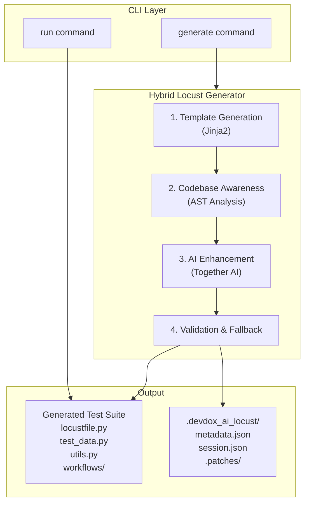
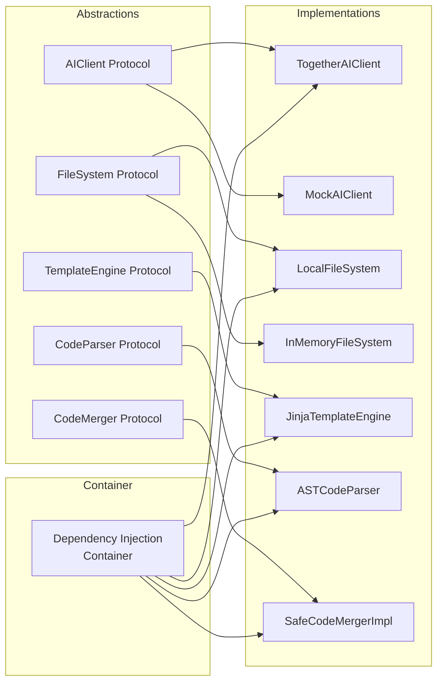
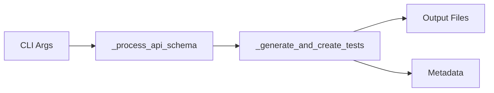
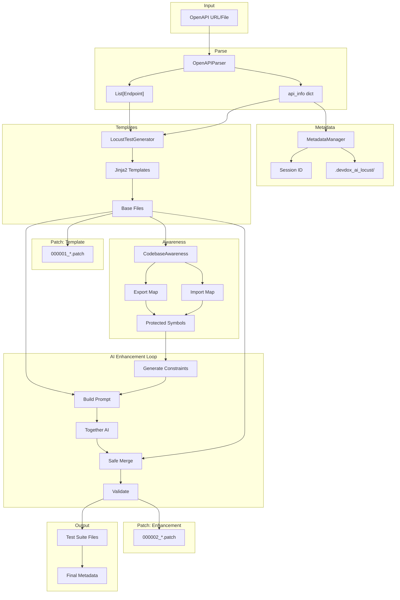
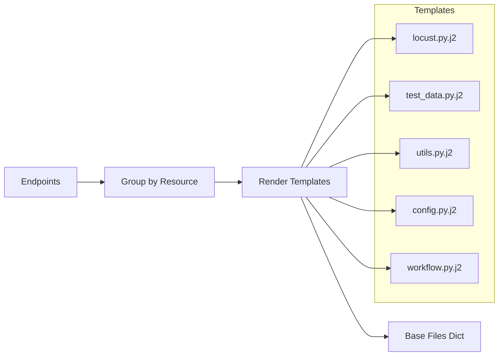
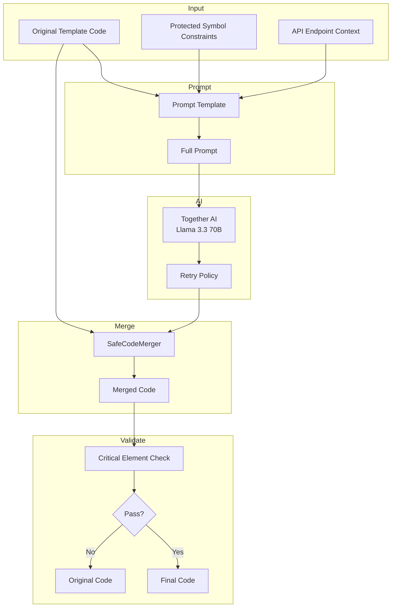
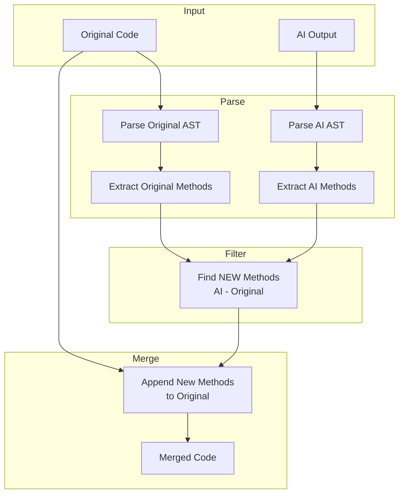

# DevDox AI Locust

[](https://opensource.org/licenses/Apache-2.0)
[](https://www.python.org/downloads/)
[](https://github.com/psf/black)

> **AI-powered Locust load test generator from API documentation**

DevDox AI Locust automatically generates comprehensive Locust load testing scripts from your API documentation (OpenAPI/Swagger specs). Using advanced AI capabilities, it creates realistic test scenarios, handles complex authentication flows, and generates production-ready performance tests.

---

# Table of Contents

1. [Quick Start](#quick-start)
2. [Glossary](#glossary)
3. [Architecture Overview](#architecture-overview)
4. [Directory Structure](#directory-structure)
5. [Core Modules Deep Dive](#core-modules-deep-dive)
6. [Abstractions & Implementations](#abstractions--implementations)
7. [The Generation Pipeline](#the-generation-pipeline)
8. [Template System](#template-system)
9. [AI Enhancement System](#ai-enhancement-system)
10. [Patch Tracking System](#patch-tracking-system)
11. [Internal Metadata Structure](#internal-metadata-structure)
12. [Configuration Reference](#configuration-reference)
13. [Extending the System](#extending-the-system)
14. [CLI Reference](#cli-reference)
15. [Testing](#testing)
16. [Troubleshooting](#troubleshooting)
17. [Design Decisions & Rationale](#design-decisions--rationale)

---

# Quick Start

## Installation

```bash
# Install from source
git clone https://github.com/montymobile1/devdox-ai-locust.git
cd devdox-ai-locust
pip install -e .
```

## Prerequisites

1. **Python 3.12+**
2. **Together AI API Key** - Get from [Together AI](https://api.together.xyz/)

## Basic Usage

```bash
# Generate from OpenAPI URL
devdox_ai_locust generate https://petstore3.swagger.io/api/v3/openapi.json \
  --output ./petstore-tests \
  --together-api-key your_api_key

# Run the generated tests
devdox_ai_locust run ./petstore-tests/locustfile.py \
  --host https://petstore3.swagger.io \
  --users 10 \
  --spawn-rate 2
```

---

# Glossary

This section defines the key terminology used throughout this project. Understanding these terms is essential for working with the codebase.

| Term | Definition |
|------|------------|
| **Milestone** | A discrete point in the code generation lifecycle where significant changes occur. Each milestone represents a logical checkpoint (e.g., after template generation, after AI enhancement). Milestones are recorded as patches in the session, enabling reproducibility and debugging. Types include: `template_generation`, `llm_enhancement`, `validation`, `user_edit`, `refactor`, `merge`. |
| **Session** | A single execution of the `generate` command. Each session gets a unique ID (datetime-based, e.g., `2025-12-29_10-39-24`) and its own directory under `.devdox_ai_locust/` containing patches and metadata. Sessions are immutable once finalized. |
| **Patch** | A unified diff file recording the changes made during a specific milestone. Patches are named with a sequence number and short UUID (e.g., `000001_a1b2c3d4.patch`). They follow the standard unified diff format and can be applied with `git apply`. |
| **Protected Symbol** | A Python class, function, or constant that is imported by other files in the generated codebase. The AI is instructed not to remove or rename protected symbols to prevent breaking cross-file dependencies. |
| **Safe Merge** | The process of combining AI-generated code with template code in a way that only adds new methods/functions without removing or modifying existing ones. This ensures AI enhancement can never break working code. |
| **Codebase Awareness** | The analysis phase where the system parses all generated files to understand their exports (what they define) and imports (what they use from other files). This builds the protected symbols map. |
| **Constraint** | Instructions provided to the AI describing what it can and cannot modify. Constraints are dynamically generated based on codebase awareness analysis and include protected symbols, allowed operations, and forbidden operations. |
| **Protocol** | A Python `typing.Protocol` class that defines an interface without implementation. Protocols enable dependency injection by allowing different implementations to be swapped (e.g., `AIClient` protocol can be `TogetherAIClient` or `MockAIClient`). |
| **Container** | The dependency injection container that creates and wires together all system components. It has factory methods for different environments: `create_production()`, `create_testing()`, `create_dry_run()`. |
| **Endpoint** | A parsed API endpoint from the OpenAPI/Swagger spec. Contains path, HTTP method, parameters, request body schema, response schemas, and description. |
| **Workflow** | A generated Python file containing Locust tasks for a specific resource/domain (e.g., `users_workflow.py`, `products_workflow.py`). Workflows are stored in the `workflows/` subdirectory. |
| **Template** | A Jinja2 file (`.j2`) that generates Python code. Templates receive context variables (endpoints, API info, config) and produce the base test files before AI enhancement. |
| **Prompt Template** | A Jinja2 file in the `prompt/` directory that generates the instruction text sent to the AI for enhancement. Different prompt templates target different files (test_data, validation, etc.). |

---

# Architecture Overview

## High-Level Design



## Component Relationships



## Design Principles

| Principle | Implementation | Why It Matters |
|-----------|----------------|----------------|
| **SOLID** | Protocol-based abstractions, dependency injection | Enables testing, extensibility, and maintainability |
| **High Cohesion** | Each module has a single, clear responsibility | Code is easier to understand and modify |
| **Low Coupling** | Components communicate through protocols, not concrete classes | Components can be replaced without affecting others |
| **Testability** | All external dependencies are injectable (AI, filesystem, templates) | Unit tests run fast without external services |
| **Progressive Enhancement** | Template base + AI additions = reliable + creative | Always produces working code, AI only improves it |
| **Safe by Default** | AI can only ADD code, never remove existing code | Prevents AI from breaking template functionality |

---

# Directory Structure

```
devdox-ai-locus/
├── src/devdox_ai_locust/
│   ├── __init__.py
│   │
│   ├── cli.py                          # CLI entry point (Click framework)
│   ├── config.py                       # Pydantic settings configuration
│   ├── container.py                    # Dependency injection container
│   │
│   ├── locust_generator.py             # Template-based code generation
│   ├── hybrid_loctus_generator.py      # AI-enhanced generation orchestrator
│   │
│   ├── abstractions/                   # Protocol definitions (interfaces)
│   │   ├── __init__.py
│   │   ├── ai_client.py               # AIClient protocol
│   │   ├── template_engine.py         # TemplateEngine protocol
│   │   ├── file_system.py             # FileSystem protocol
│   │   ├── code_parser.py             # CodeParser protocol
│   │   ├── code_merger.py             # CodeMerger protocol
│   │   ├── retry_policy.py            # RetryPolicy protocol
│   │   └── test_generator.py          # TestGenerator, EnhancementStrategy
│   │
│   ├── implementations/                # Concrete implementations
│   │   ├── __init__.py
│   │   ├── ai_clients.py              # TogetherAIClient, MockAIClient
│   │   ├── template_engines.py        # JinjaTemplateEngine
│   │   ├── file_systems.py            # LocalFileSystem, InMemoryFileSystem
│   │   ├── code_parsers.py            # ASTCodeParser, RegexCodeParser
│   │   ├── code_mergers.py            # SafeCodeMergerImpl
│   │   └── retry_policies.py          # ExponentialBackoffPolicy
│   │
│   ├── schemas/                        # Pydantic data models
│   │   ├── __init__.py
│   │   ├── processing_result.py       # SwaggerProcessingRequest
│   │   └── progress.py                # ProgressStatus, ProgressPhase
│   │
│   ├── utils/                          # Utility modules
│   │   ├── __init__.py
│   │   ├── metadata_manager.py        # Central metadata management
│   │   ├── patch_tracker.py           # Milestone-based patch tracking
│   │   ├── open_ai_parser.py          # OpenAPI/Swagger parser
│   │   ├── swagger_utils.py           # Schema fetching utilities
│   │   ├── file_creation.py           # Safe file creation
│   │   └── naming.py                  # Python naming conventions
│   │
│   ├── templates/                      # Jinja2 code generation templates
│   │   ├── locust.py.j2               # Main locustfile
│   │   ├── test_data.py.j2            # Test data generator
│   │   ├── utils.py.j2                # Utilities (validators, loggers)
│   │   ├── config.py.j2               # Configuration
│   │   ├── base_workflow.py.j2        # Base workflow class
│   │   ├── endpoint_template.py.j2    # Individual endpoint handlers
│   │   └── ... (22 template files)
│   │
│   └── prompt/                         # AI prompt templates
│       ├── locust.j2                  # Enhance main locustfile
│       ├── test_data.j2               # Enhance test data
│       ├── validation.j2              # Enhance validation utils
│       ├── domain.j2                  # Generate domain flows
│       └── workflow.j2                # Enhance workflows
│
├── tests/                              # Test suite
├── pyproject.toml                      # Project metadata
└── README.md                           # This file
```

---

# Core Modules Deep Dive

## cli.py - Command Line Interface

**Purpose**: The entry point for all user interactions. Built with Click framework, it parses command-line arguments, orchestrates the generation pipeline, and displays progress using Rich library.

**Why it exists**: Provides a clean separation between user interface and business logic. The CLI handles argument parsing, validation, progress display, and error presentation, while delegating actual work to the generator classes.

**Key Components**:

```python
@click.group()
def cli():
    """DevDox AI LoadTest - Generate Locust tests from API documentation"""

@cli.command()
def generate(swagger_source, output, ...):
    """Generate Locust tests from OpenAPI/Swagger spec"""

@cli.command()
def run(test_file, host, users, ...):
    """Run generated Locust tests"""
```

**ProgressDisplay Class**: Provides real-time feedback during generation using Rich's Live display. Shows current phase, elapsed time, and spinner animation. The 13 phases track progress through parsing, template generation, AI enhancement, and file writing.



---

## locust_generator.py - Template Generator

**Purpose**: Generates the base test files from parsed API endpoints using Jinja2 templates. This is the "reliable foundation" of the hybrid approach.

**Why it exists**: Templates provide deterministic, tested output. Unlike pure AI generation, template-based generation always produces syntactically correct, working code. The AI enhancement layer then adds creativity on top of this solid base.

**Key Class**: `LocustTestGenerator`

This class takes parsed endpoints and renders them through Jinja2 templates to produce:
- `locustfile.py` - Main Locust test orchestrator
- `test_data.py` - Test data generation utilities
- `utils.py` - Response validators, loggers, monitors
- `config.py` - Environment configuration
- `workflows/*.py` - Per-resource test workflows

```python
class LocustTestGenerator:
    def generate_from_endpoints(
        self,
        endpoints: List[Endpoint],
        api_info: Dict[str, Any],
        include_auth: bool = True,
        target_host: str = "",
        db_type: str = "",
    ) -> Tuple[Dict[str, str], List[Dict[str, str]], Dict[str, List[Endpoint]]]:
        """
        Generate test files from parsed endpoints.

        The method groups endpoints by resource (e.g., /users/*, /products/*),
        renders templates for each group, and returns both main files and
        workflow files.

        Returns:
            - base_files: Dict of {filename: content}
            - directory_files: List of workflow file dicts
            - grouped_endpoints: Endpoints grouped by resource
        """
```

---

## hybrid_loctus_generator.py - AI Enhancement Orchestrator

**Purpose**: Orchestrates the complete generation pipeline, combining template generation with AI enhancement. This is the brain of the system.

**Why it exists**: Pure templates are reliable but generic. Pure AI is creative but unpredictable. The hybrid approach gives us the best of both: reliable base code enhanced with AI creativity, with multiple safety mechanisms to prevent corruption.

**Key Classes**:

### HybridLocustGenerator

The main orchestrator that coordinates the entire pipeline. It manages the flow from raw endpoints to enhanced test files, handling template generation, codebase analysis, AI enhancement, safe merging, and validation.

```python
class HybridLocustGenerator:
    """
    Main orchestrator for template + AI hybrid generation.

    The generation pipeline:
    1. Template Generation - Create base files with Jinja2
    2. Codebase Awareness - Analyze cross-file dependencies
    3. AI Enhancement - Enhance each file with constraints
    4. Safe Merge - Combine AI output with originals
    5. Validation - Verify critical elements exist
    """

    async def generate_from_endpoints(
        self,
        endpoints: List[Endpoint],
        api_info: Dict[str, Any],
        custom_requirement: str = "",
        target_host: str = "",
        include_auth: bool = True,
        db_type: str = "",
    ) -> Tuple[Dict[str, str], List[Dict[str, str]]]:
        """Execute the full generation pipeline."""
```

### CodebaseAwareness

Analyzes the generated codebase to understand cross-file dependencies. This is crucial for preventing the AI from removing code that other files depend on.

```python
class CodebaseAwareness:
    """
    Analyzes cross-file dependencies to protect critical symbols.

    For example, if locustfile.py imports TestDataGenerator from test_data.py,
    the AI must be instructed not to remove TestDataGenerator when enhancing
    test_data.py. This class builds that dependency map.
    """

    def analyze_codebase(self, base_files, directory_files):
        """
        Build maps of exports, imports, and protected symbols.

        Uses AST parsing to extract:
        - What each file exports (classes, functions, constants)
        - What each file imports (from which files)
        - Which symbols are protected (imported by other files)
        """

    def get_constraints_for_file(self, filename: str) -> str:
        """
        Generate human-readable constraints for AI.

        Returns a formatted string like:
        🔒 PROTECTED SYMBOLS (DO NOT REMOVE):
          CLASSES: TestDataGenerator
            Reason: Imported by: locustfile.py
        """
```

### SafeCodeMerger

The safety net that ensures AI can never break existing code. It uses AST parsing to extract only new methods from AI output and append them to the original code.

```python
class SafeCodeMerger:
    """
    AST-based merger that ONLY adds new methods, never removes.

    This is the core safety mechanism. Even if the AI returns code
    that removes methods, this merger will:
    1. Keep all original methods intact
    2. Extract only NEW methods from AI output
    3. Append new methods to original classes
    """

    def safe_merge(
        self,
        original: str,
        ai_additions: str,
        target_class: Optional[str] = None
    ) -> MergeResult:
        """
        Merge AI output into original code safely.

        Algorithm:
        1. Parse original code with AST
        2. Extract existing method names
        3. Parse AI output (AST with regex fallback)
        4. Extract AI's methods
        5. Filter: keep only methods NOT in original
        6. Append new methods to original class
        """
```

---

## container.py - Dependency Injection

**Purpose**: Factory for creating configured component instances. Implements the Dependency Injection pattern to decouple components from their concrete implementations.

**Why it exists**: Testing AI-powered code is hard when you can't control the AI. The container allows swapping real implementations for mocks, enabling fast, deterministic tests. It also enables different configurations for production, testing, and dry-run modes.

```python
class Container:
    """
    DI Container with factory methods for different environments.

    The container holds references to all major components and provides
    factory methods that wire everything together correctly.
    """

    @classmethod
    def create_production(
        cls,
        api_key: str,
        output_dir: Path,
        template_dir: Optional[Path] = None,
    ) -> "Container":
        """
        Production container with real implementations.

        Uses:
        - TogetherAIClient for real AI calls
        - LocalFileSystem for real file I/O
        - JinjaTemplateEngine with file-based templates
        """

    @classmethod
    def create_testing(
        cls,
        templates: Optional[Dict[str, str]] = None,
        ai_responses: Optional[Dict[str, str]] = None,
    ) -> "Container":
        """
        Testing container with mocks.

        Uses:
        - MockAIClient with predefined responses
        - InMemoryFileSystem (no disk I/O)
        - InMemoryTemplateEngine
        """

    @classmethod
    def create_dry_run(cls) -> "Container":
        """
        Dry-run container (no side effects).

        Uses real parsing and generation but doesn't write
        files or make AI calls.
        """
```

---

# Abstractions & Implementations

The system uses Protocol-based abstractions for all external dependencies. This enables:
- **Testing**: Swap real services for mocks
- **Extensibility**: Add new implementations without changing consumers
- **Flexibility**: Different configurations for different environments

## Protocol Overview

| Protocol | Purpose | Implementations |
|----------|---------|-----------------|
| `AIClient` | LLM interaction | `TogetherAIClient`, `MockAIClient` |
| `TemplateEngine` | Template rendering | `JinjaTemplateEngine`, `InMemoryTemplateEngine` |
| `FileSystem` | File I/O | `LocalFileSystem`, `InMemoryFileSystem` |
| `CodeParser` | Python AST analysis | `ASTCodeParser`, `RegexCodeParser`, `CompositeCodeParser` |
| `CodeMerger` | Safe code merging | `SafeCodeMergerImpl` |
| `RetryPolicy` | Retry strategies | `ExponentialBackoffPolicy`, `RateLimitAwarePolicy` |

## AIClient Protocol

Defines the interface for LLM interactions. Any AI provider can be used by implementing this protocol.

```python
class AIClient(Protocol):
    async def complete(self, request: AICompletionRequest) -> AICompletionResponse:
        """Send completion request to LLM"""
        ...

    def is_available(self) -> bool:
        """Check if client is configured and available"""
        ...

@dataclass
class AICompletionRequest:
    messages: List[Dict[str, str]]  # Chat messages
    model: str = "meta-llama/Llama-3.3-70B-Instruct-Turbo"
    max_tokens: int = 8000
    temperature: float = 0.3  # Low for deterministic output
    timeout: int = 60

@dataclass
class AICompletionResponse:
    content: str           # Generated text
    model: str             # Model used
    usage: Dict[str, int]  # Token counts
    finish_reason: str     # Why generation stopped
```

## FileSystem Protocol

Abstracts file operations to enable in-memory testing.

```python
class FileSystem(Protocol):
    def read_text(self, path: Path) -> str:
        """Read file contents as text"""
        ...

    def write_text(self, path: Path, content: str) -> WriteResult:
        """Write text content to file"""
        ...

    def exists(self, path: Path) -> bool:
        """Check if path exists"""
        ...

    def mkdir(self, path: Path, parents: bool = False) -> None:
        """Create directory, optionally with parents"""
        ...
```

## CodeParser Protocol

Defines the interface for Python code analysis using AST.

```python
class CodeParser(Protocol):
    def extract_classes(self, code: str) -> List[str]:
        """Extract class names defined in code"""
        ...

    def extract_functions(self, code: str) -> List[str]:
        """Extract top-level function names"""
        ...

    def extract_methods(self, code: str, class_name: str) -> List[str]:
        """Extract method names from a specific class"""
        ...

    def extract_imports(self, code: str) -> CodeImports:
        """Extract all import statements"""
        ...
```

---

# The Generation Pipeline

## Complete Data Flow



## Pipeline Phases

| Phase | Component | Input | Output | Can Fail? |
|-------|-----------|-------|--------|-----------|
| 1. Parse | OpenAPIParser | URL/File | Endpoints, API Info | Yes - invalid spec |
| 2. Initialize | MetadataManager | API Info | Session ID, directories | No |
| 3. Template | LocustTestGenerator | Endpoints | Base files | No |
| 4. Patch | PatchTracker | Base files | template_generation patch | No |
| 5. Analyze | CodebaseAwareness | Base files | Protected symbols | No |
| 6. Enhance | Together AI | Files + constraints | Enhanced code | Yes - falls back |
| 7. Merge | SafeCodeMerger | Original + AI | Merged code | No |
| 8. Validate | HybridGenerator | Merged code | Validated code | Falls back to original |
| 9. Patch | PatchTracker | Enhanced files | llm_enhancement patch | No |
| 10. Write | FileSystem | Final files | Disk files | Yes - permissions |

---

# Template System

## Template Directory Structure

Templates are Jinja2 files that generate Python code. They receive context variables and produce the base test files.

```
templates/
├── locust.py.j2              # Main test orchestrator with HttpUser classes
├── user_classes.py.j2        # Locust HttpUser class definitions
├── test_data.py.j2           # TestDataGenerator for realistic test data
├── utils.py.j2               # ResponseValidator, RequestLogger, PerformanceMonitor
├── config.py.j2              # LoadTestConfig with environment settings
├── custom_flows.py.j2        # Domain-specific test flows
├── base_workflow.py.j2       # BaseAPIUser, BaseTaskMethods
├── endpoint_template.py.j2   # Individual endpoint task handlers
├── fallback_locust.py.j2     # Fallback if generation fails
├── env.example.j2            # .env template
├── readme.md.j2              # Generated README
├── requirement.txt.j2        # Python requirements
└── mongo/                    # MongoDB integration
    ├── db_integration.j2
    ├── db_config.py.j2
    └── data_provider.py.j2
```

## Template Variables

Templates receive a context dictionary with these variables:

```python
{
    # API Information (from OpenAPI spec)
    "api_title": "Pet Store API",
    "api_version": "1.0.0",
    "base_url": "https://petstore.swagger.io/v2",

    # Parsed Endpoints
    "endpoints": [Endpoint(...), ...],
    "grouped_endpoints": {"pets": [...], "users": [...]},

    # Configuration
    "target_host": "https://api.example.com",
    "include_auth": True,
    "db_type": "mongo",  # or "postgresql" or ""

    # Generated Content
    "import_statements": [...],
    "task_classes": [...],
    "workflow_imports": [...],
}
```

## Template Rendering Flow



---

# AI Enhancement System

## How Enhancement Works

The AI enhancement system takes template-generated code and improves it with more realistic test logic, better data generation, and domain-specific behaviors.



## Prompt Templates

Located in `prompt/` directory, these templates generate the instructions sent to the AI:

| Template | Purpose | Target File |
|----------|---------|-------------|
| `test_data.j2` | Enhance test data generation methods | `test_data.py` |
| `validation.j2` | Enhance response validation logic | `utils.py` |
| `locust.j2` | Enhance main test orchestration | `locustfile.py` |
| `domain.j2` | Generate domain-specific test flows | `custom_flows.py` |
| `workflow.j2` | Enhance per-resource workflows | `workflows/*.py` |

## Constraint Generation

The CodebaseAwareness class generates constraints that tell the AI what it cannot modify:

```
🔒 PROTECTED SYMBOLS (DO NOT REMOVE - used by other files):

CLASSES:
  - TestDataGenerator
    Reason: Imported by: locustfile.py, workflows/user_workflow.py
  - ResponseValidator
    Reason: Imported by: locustfile.py

FUNCTIONS:
  - generate_json_data()
    Reason: Used by: TestDataGenerator class

✅ You MAY:
  - ADD new methods to existing classes
  - ADD new helper functions
  - MODIFY method implementations (keep signatures)

❌ You MUST NOT:
  - DELETE or RENAME any protected symbol above
  - CHANGE the signature of protected methods
  - REMOVE imports that other files depend on
```

## Safe Merge Algorithm



**Example**:

```python
# Original (from template)
class TestDataGenerator:
    def generate_id(self): return 1
    def generate_name(self): return "test"

# AI Output (may have removed methods!)
class TestDataGenerator:
    def generate_id(self): return 1  # AI kept this
    def generate_email(self): return "test@example.com"  # AI added
    # AI removed generate_name!

# SafeCodeMerger Result
class TestDataGenerator:
    def generate_id(self): return 1         # Original preserved
    def generate_name(self): return "test"  # Original preserved

    # AI-added method
    def generate_email(self): return "test@example.com"  # New method added
```

---

# Patch Tracking System

## Design Philosophy

The patch tracking system is inspired by PostgreSQL's Write-Ahead Log (WAL). It records every significant change as a "milestone" with an associated patch file, enabling:

- **Reproducibility**: Replay the exact changes from any session
- **Debugging**: See exactly what the AI changed
- **Auditing**: Track the evolution of generated code
- **Rollback**: Understand what was added at each step

## Directory Structure

```
.devdox_ai_locust/
├── metadata.json                    # Central metadata (API info, config, file tree)
└── {session_id}/                    # e.g., 2025-12-29_10-39-24
    ├── session.json                 # Session milestones and patches index
    └── .patches/                    # Sequential patch files
        ├── 000001_a1b2c3d4.patch   # template_generation milestone
        ├── 000002_e5f6g7h8.patch   # llm_enhancement milestone
        └── 000003_f9g0h1i2.patch   # validation milestone (if applicable)
```

## Milestone Types

```python
class Milestone(str, Enum):
    TEMPLATE_GENERATION = "template_generation"  # Initial Jinja2 output
    LLM_ENHANCEMENT = "llm_enhancement"          # AI additions
    VALIDATION = "validation"                     # Post-validation fixes
    USER_EDIT = "user_edit"                       # Manual changes (future)
    REFACTOR = "refactor"                         # Code restructuring (future)
    MERGE = "merge"                               # Merging changes (future)
```

## session.json Structure

```json
{
  "version": "3.0",
  "session_id": "2025-12-29_10-39-24",
  "created_at": "2025-12-29T10:39:24Z",
  "updated_at": "2025-12-29T10:41:00Z",
  "patches": [
    {
      "id": "000001_a1b2c3d4",
      "sequence": 1,
      "milestone": "template_generation",
      "description": "Initial template-based generation",
      "created_at": "2025-12-29T10:39:24Z",
      "stats": {
        "files_changed": 8,
        "additions": 450,
        "deletions": 0
      },
      "metadata": {}
    },
    {
      "id": "000002_e5f6g7h8",
      "sequence": 2,
      "milestone": "llm_enhancement",
      "description": "AI enhancement of test files",
      "created_at": "2025-12-29T10:40:15Z",
      "stats": {
        "files_changed": 3,
        "additions": 120,
        "deletions": 15
      },
      "metadata": {
        "ai_model": "meta-llama/Llama-3.3-70B-Instruct-Turbo"
      }
    }
  ]
}
```

## Patch File Format

Patches use standard unified diff format (compatible with `git apply`):

```diff
--- a/test_data.py
+++ b/test_data.py
@@ -25,6 +25,15 @@
     def generate_string(self, length: int = 10) -> str:
         return ''.join(secrets.choice(string.ascii_letters) for _ in range(length))

+    def generate_realistic_email(self, domain: str = "example.com") -> str:
+        """Generate a realistic email address"""
+        username = self.fake.first_name().lower()
+        return f"{username}@{domain}"
+
+    def generate_phone_number(self) -> str:
+        """Generate a realistic phone number"""
+        return self.fake.phone_number()
```

---

# Internal Metadata Structure

## metadata.json

The central metadata file tracks session info, API details, configuration, and the generated file tree:

```json
{
  "version": "3.0",
  "session_id": "2025-12-29_10-39-24",
  "created_at": "2025-12-29T10:39:24+00:00",
  "updated_at": "2025-12-29T10:41:00+00:00",
  "api": {
    "title": "Pet Store API",
    "version": "1.0.0",
    "base_url": "https://petstore.swagger.io/v2",
    "description": "A sample API",
    "endpoints_count": 15,
    "swagger_source": "https://petstore.swagger.io/v2/swagger.json",
    "source_type": "url"
  },
  "config": {
    "host": "https://petstore.swagger.io",
    "auth_enabled": true,
    "db_type": "",
    "ai_model": "meta-llama/Llama-3.3-70B-Instruct-Turbo",
    "custom_requirement": ""
  },
  "files": {
    "locustfile.py": {"size": 2345, "lines": 78},
    "test_data.py": {"size": 1890, "lines": 62},
    "utils.py": {"size": 3456, "lines": 112},
    "config.py": {"size": 567, "lines": 23},
    "workflows/__init__.py": {"size": 45, "lines": 2},
    "workflows/base_workflow.py": {"size": 1234, "lines": 45},
    "workflows/pets_workflow.py": {"size": 2345, "lines": 78}
  }
}
```

## Pydantic Models

```python
class FileNode(BaseModel):
    """Metadata for a generated file in the test suite tree"""
    size: int = 0   # Size in bytes
    lines: int = 0  # Line count

class APIMetadata(BaseModel):
    """API information extracted from OpenAPI spec"""
    title: str = "Unknown"
    version: str = "Unknown"
    base_url: str = ""
    endpoints_count: int = 0
    swagger_source: str = ""
    source_type: str = ""  # "url" or "file"

class GenerationConfig(BaseModel):
    """Configuration used for this generation session"""
    host: str = ""
    auth_enabled: bool = True
    db_type: str = ""
    ai_model: str = ""
    custom_requirement: str = ""

class CentralMetadata(BaseModel):
    """Root metadata structure stored in metadata.json"""
    version: str = "3.0"
    session_id: str = ""
    created_at: str = ""
    updated_at: str = ""
    api: APIMetadata
    config: GenerationConfig
    files: Dict[str, FileNode]  # File tree
```

---

# Configuration Reference

## Environment Variables

| Variable | Required | Description | Default |
|----------|----------|-------------|---------|
| `TOGETHER_API_KEY` | Yes | Together AI API key for LLM calls | None |
| `DEVDOX_LOG_LEVEL` | No | Logging level (DEBUG, INFO, WARNING, ERROR) | `INFO` |
| `DEVDOX_TEMPLATE_DIR` | No | Path to custom template directory | Built-in templates |

## CLI Options

### `generate` Command

| Option | Short | Type | Required | Description | Default |
|--------|-------|------|----------|-------------|---------|
| `swagger_source` | | Argument | **Yes** | OpenAPI URL or file path | - |
| `--output` | `-o` | Path | No | Output directory for generated tests | `output` |
| `--users` | `-u` | Integer | No | Number of simulated users | `10` |
| `--spawn-rate` | `-r` | Float | No | User spawn rate (users/second) | `2` |
| `--run-time` | `-t` | String | No | Test duration (e.g., 5m, 1h, 30s) | `5m` |
| `--host` | `-H` | URL | No | Target host URL (overrides spec) | From spec |
| `--auth/--no-auth` | | Boolean | No | Include authentication handling | `True` |
| `--db-type` | | String | No | Database integration (mongo, postgresql) | None |
| `--dry-run` | | Flag | No | Parse and generate without writing files | `False` |
| `--custom-requirement` | | String | No | Custom instructions for AI enhancement | None |
| `--together-api-key` | | String | No | Together AI API key (overrides env) | From env |
| `--verbose` | `-v` | Flag | No | Enable verbose logging output | `False` |

### `run` Command

| Option | Short | Type | Required | Description | Default |
|--------|-------|------|----------|-------------|---------|
| `test_file` | | Argument | **Yes** | Path to generated locustfile.py | - |
| `--host` | `-H` | URL | **Yes** | Target host URL to test | - |
| `--users` | `-u` | Integer | No | Number of simulated users | `10` |
| `--spawn-rate` | `-r` | Float | No | User spawn rate (users/second) | `2` |
| `--run-time` | `-t` | String | No | Test duration | `5m` |
| `--headless` | | Flag | No | Run without web UI | `False` |

## AI Configuration

These values are configured in `hybrid_loctus_generator.py`:

```python
AI_CONFIG = {
    "model": "meta-llama/Llama-3.3-70B-Instruct-Turbo",
    "max_tokens": 8000,     # Maximum tokens in response
    "temperature": 0.3,     # Low for deterministic output
    "timeout": 60,          # Seconds per request
}

RETRY_CONFIG = {
    "max_attempts": 3,      # Number of retry attempts
    "base_backoff": 1.0,    # Initial backoff in seconds
    "max_backoff": 60.0,    # Maximum backoff
}
```

---

# Extending the System

## Adding a New AI Provider

1. Create implementation in `implementations/ai_clients.py`:

```python
class OpenAIClient:
    """OpenAI API client implementing AIClient protocol"""

    def __init__(self, api_key: str, model: str = "gpt-4"):
        self.client = openai.AsyncOpenAI(api_key=api_key)
        self.model = model

    async def complete(self, request: AICompletionRequest) -> AICompletionResponse:
        response = await self.client.chat.completions.create(
            model=self.model,
            messages=request.messages,
            max_tokens=request.max_tokens,
            temperature=request.temperature,
        )
        return AICompletionResponse(
            content=response.choices[0].message.content,
            model=self.model,
            usage=dict(response.usage),
            finish_reason=response.choices[0].finish_reason,
        )

    def is_available(self) -> bool:
        return self.client is not None
```

2. Add factory method in `container.py`:

```python
@classmethod
def create_openai(cls, api_key: str, output_dir: Path) -> "Container":
    container = cls()
    container._ai_client = OpenAIClient(api_key)
    container._file_system = LocalFileSystem()
    container._template_engine = JinjaTemplateEngine(TEMPLATE_DIR)
    return container
```

## Adding a New Milestone Type

1. Add to `Milestone` enum in `metadata_manager.py`:

```python
class Milestone(str, Enum):
    TEMPLATE_GENERATION = "template_generation"
    LLM_ENHANCEMENT = "llm_enhancement"
    VALIDATION = "validation"
    USER_EDIT = "user_edit"
    REFACTOR = "refactor"
    MERGE = "merge"
    # Add new milestones here
    SYNTAX_FIX = "syntax_fix"
    OPTIMIZATION = "optimization"
```

2. Use in `PatchTracker`:

```python
# Capture state after a syntax fix
tracker._create_milestone_patch(
    milestone="syntax_fix",
    files_before=original_files,
    files_after=fixed_files,
    description="Fixed syntax errors detected by linter"
)
```

## Adding a New Template

1. Create template file `templates/my_module.py.j2`:

```jinja2
"""{{ api_title }} - My Custom Module

Auto-generated module for custom functionality.
"""
from typing import Dict, Any


class {{ endpoint.class_name }}Handler:
    """Handler for {{ endpoint.method }} {{ endpoint.path }}"""

    def execute(self, client, data: Dict[str, Any]):
        return client.{{ endpoint.method.lower() }}(
            "{{ endpoint.path }}",
            json=data
        )

```

2. Add rendering in `locust_generator.py`:

```python
def generate_from_endpoints(self, endpoints, api_info, ...):
    files = {}
    # ... existing file generation ...

    # Add your new template
    files["my_module.py"] = self.env.get_template(
        "my_module.py.j2"
    ).render(
        endpoints=endpoints,
        api_title=api_info.get("title", "API"),
    )

    return files, directory_files, grouped
```

## Adding a New CLI Command

```python
# In cli.py

@cli.command()
@click.argument("path", type=click.Path(exists=True))
@click.option("--format", type=click.Choice(["json", "yaml", "table"]), default="json")
def analyze(path: str, format: str):
    """Analyze a generated test suite and show metadata."""
    metadata_path = Path(path) / ".devdox_ai_locust" / "metadata.json"

    if not metadata_path.exists():
        console.print("[red]No metadata found. Is this a generated test suite?[/red]")
        raise SystemExit(1)

    metadata = json.loads(metadata_path.read_text())

    if format == "json":
        console.print_json(data=metadata)
    elif format == "yaml":
        import yaml
        console.print(yaml.dump(metadata, default_flow_style=False))
    else:
        # Table format
        table = Table(title="Test Suite Metadata")
        table.add_column("Property", style="cyan")
        table.add_column("Value", style="green")
        table.add_row("Session ID", metadata["session_id"])
        table.add_row("API Title", metadata["api"]["title"])
        table.add_row("Endpoints", str(metadata["api"]["endpoints_count"]))
        table.add_row("Files", str(len(metadata["files"])))
        console.print(table)
```

---

# CLI Reference

## Complete Command Examples

```bash
# Generate from URL with all options
devdox_ai_locust generate https://api.example.com/openapi.json \
  --output ./tests \
  --host https://api.example.com \
  --users 50 \
  --spawn-rate 5 \
  --run-time 10m \
  --auth \
  --db-type mongo \
  --custom-requirement "Focus on edge cases and error scenarios" \
  --together-api-key $TOGETHER_API_KEY \
  --verbose

# Generate from local file
devdox_ai_locust generate ./swagger.yaml \
  --output ./tests \
  --no-auth

# Dry run (parse and generate without writing)
devdox_ai_locust generate https://api.example.com/spec.json \
  --dry-run \
  --verbose

# Run generated tests with web UI
devdox_ai_locust run ./tests/locustfile.py \
  --host https://api.example.com \
  --users 100 \
  --spawn-rate 10 \
  --run-time 5m

# Run headless (CI/CD)
devdox_ai_locust run ./tests/locustfile.py \
  --host https://api.example.com \
  --users 50 \
  --spawn-rate 5 \
  --run-time 2m \
  --headless
```

---

# Testing

## Running Tests

```bash
# Run all tests
pytest tests/ -v

# Run with coverage report
coverage run -m pytest tests/
coverage report -m

# Run specific test file
pytest tests/test_generator.py -v

# Run tests matching pattern
pytest tests/ -k "test_safe_merge" -v
```

## Test Structure

```
tests/
├── test_cli.py                 # CLI command tests
├── test_generator.py           # Template generator tests
├── test_hybrid_generator.py    # AI enhancement tests
├── test_metadata_manager.py    # Metadata management tests
├── test_patch_tracker.py       # Patch tracking tests
├── test_code_parser.py         # AST parsing tests
├── test_safe_merger.py         # Code merging tests
└── conftest.py                 # Pytest fixtures
```

## Writing Tests with Mocks

```python
import pytest
from devdox_ai_locust.container import Container

@pytest.fixture
def mock_container():
    """Create a testing container with mocked dependencies"""
    return Container.create_testing(
        ai_responses={
            "enhance": "def new_method(self): return 'enhanced'"
        },
        templates={
            "test.j2": "# Generated: {{ api_title }}"
        }
    )

async def test_generation_with_mock_ai(mock_container):
    """Test that AI enhancement adds new methods"""
    generator = HybridLocustGenerator(
        ai_client=mock_container.ai_client,
        template_engine=mock_container.template_engine,
    )

    result = await generator.generate_from_endpoints(
        endpoints=[...],
        api_info={"title": "Test API"}
    )

    assert "new_method" in result["test_data.py"]
```

---

# Troubleshooting

## Common Issues

### "No module named 'devdox_ai_locust'"

```bash
# Install in development mode
pip install -e .

# Verify installation
python -c "import devdox_ai_locust; print('OK')"
```

### API Key Issues

```bash
# Check environment variable
echo $TOGETHER_API_KEY

# Test API connectivity
python -c "
from together import Together
client = Together(api_key='your_key')
print(client.models.list()[:1])
"
```

### AI Enhancement Fallback Messages

If you see messages like:
```
"AI corrupted utils.py: missing critical class 'ResponseValidator'"
"Reverting utils.py to original template code"
```

This is **expected behavior**. The system detected that AI output was missing critical elements and safely reverted to template code. The generated tests will still work correctly.

### Template Errors

```bash
# Validate your OpenAPI spec
# Use online validator: https://editor.swagger.io/

# Check Jinja2 syntax in custom templates
python -c "
from jinja2 import Environment, FileSystemLoader
env = Environment(loader=FileSystemLoader('templates/'))
template = env.get_template('my_template.j2')
print('Template syntax OK')
"
```

### Viewing Patch History

```bash
# Check .devdox_ai_locust directory
ls -la output/.devdox_ai_locust/

# View session info
cat output/.devdox_ai_locust/*/session.json | python -m json.tool

# List patches
ls output/.devdox_ai_locust/*/.patches/

# View a specific patch
cat output/.devdox_ai_locust/2025-12-29_10-39-24/.patches/000002_*.patch
```

---

# Design Decisions & Rationale

## Why Protocol-based Abstractions?

**Problem**: Tight coupling to external services (AI providers, filesystem) makes testing difficult and limits flexibility.

**Solution**: Define protocols (interfaces) for all external dependencies. Any component that talks to external services does so through a protocol, not a concrete class.

**Benefits**:
- Unit tests run fast without external services
- Easy to add new AI providers (OpenAI, Anthropic, local models)
- Dry-run mode works without any changes to business logic
- Components can be tested in isolation

## Why Template + AI Hybrid Approach?

**Problem**: Pure AI generation is creative but unpredictable. It may produce code that doesn't compile, missing critical functions, or with inconsistent structure.

**Solution**: Two-phase generation where templates provide the reliable foundation and AI adds enhancements.

**Benefits**:
- Templates are tested and always produce working code
- AI focuses on enhancement rather than structure
- If AI fails, we fall back to working template code
- Predictable file structure regardless of AI behavior

## Why Safe Code Merging?

**Problem**: When asked to enhance code, AI often "simplifies" by removing existing methods it deems unnecessary. This breaks cross-file dependencies.

**Solution**: `SafeCodeMerger` uses AST parsing to extract only NEW methods from AI output and append them to the original. The original code is never modified.

**Benefits**:
- AI can never break existing functionality
- Cross-file imports always work (protected symbols preserved)
- Original structure and methods always preserved
- Only additive changes from AI

## Why Milestone-based Patch Tracking?

**Problem**: Need to understand exactly what the AI changed for debugging and reproducibility. Need audit trail for compliance.

**Solution**: PostgreSQL WAL-inspired tracking where each logical change is a "milestone" with an associated patch file.

**Benefits**:
- Full audit trail of all changes
- Can diff any two milestones
- Easy debugging ("what did the AI add?")
- Reproducible generation sessions
- Standard unified diff format

## Why Pydantic for Data Models?

**Problem**: Complex data structures (API specs, config, metadata) need validation. Python dicts don't provide any guarantees.

**Solution**: Pydantic models for all data structures with automatic validation.

**Benefits**:
- Runtime validation catches errors early
- Self-documenting data structures
- JSON serialization built-in
- IDE autocomplete works
- Clear error messages on invalid data

---

# License

This project is licensed under the Apache License 2.0 - see the [LICENSE](LICENSE) file for details.

---

**Made with care by the DevDox team**
